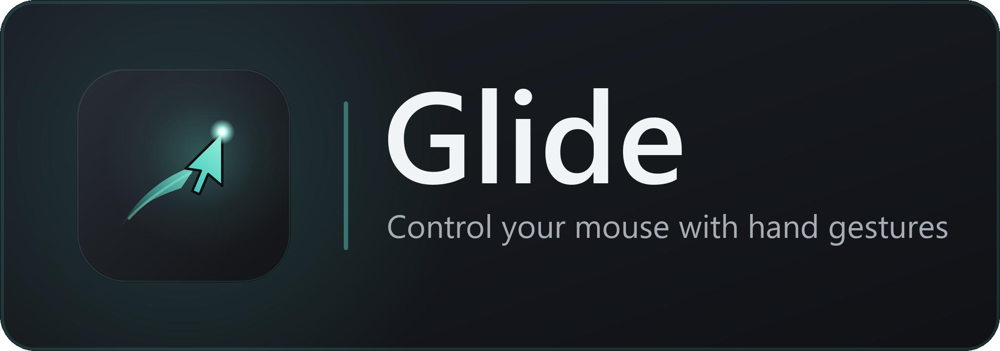

<p align="center">
  
</p>

<p align="center">
  Use your webcam and hand to drive the cursor on <b>any number of monitors</b>.
</p>


| Gesture | Action |
| --- | --- |
| Move your hand (open palm) | Cursor follows the **centre of your palm** |
| **Pinch** thumb + **index** together | **Left click** |
| **Pinch** thumb + **index** twice, quickly | **Double click** |
| **Pinch** thumb + **middle** together | **Right click** |
| **Close your fist** → move → **open your hand** | **Drag & drop** (grab, move, release) |
| Two fingers up — index + middle ("peace sign") | **Scroll** — move them up/down |

These gestures were chosen to be both **easy for you** and **reliable to
detect**. A pinch and a fist are measured as *distances between fingertips*,
which don't care how your hand is rotated — far steadier than trying to tell
"is this one finger bent." Pinching to click is quick and precise (it's how you
pick up a small object); grabbing with a fist to drag is completely natural.

Because the cursor follows your **palm centre**, pinching or grabbing never
knocks the pointer off target.

**Clicks not registering?** The HUD shows `pinch i<n> m<n> open<n>`:
- For a **left** click, `i` (thumb↔index) should drop below `--pinch` (0.5).
- For a **right** click, `m` (thumb↔middle) should drop below `--pinch`.
- For a **grab/drag**, `open` should drop below `--grab` (1.2).

If clicks are hard to trigger, raise `--pinch` (e.g. `0.6`). If a grab is hard,
raise `--grab` (e.g. `1.4`).

**Double click** is just two quick index pinches — each pinch is a real left
click, so Windows treats two within its double-click time as a double click
(the app prints that window on startup). If double-clicking feels too fussy,
slow the *double-click speed* in Windows mouse settings to widen the window.

The camera frame is mapped onto the whole Windows *virtual desktop* — the
rectangle that spans every connected display — so multi-monitor setups (and
monitors placed left of / above the primary one) work out of the box. The app
is DPI-aware, so mixed display-scaling stays accurate.

## Requirements

- Windows
- Python 3.9+ with `opencv-python`, `mediapipe`, `numpy` (a TOML config file
  needs 3.11+)
- A webcam

Install dependencies:

```
py -m pip install -r requirements.txt
```

On first run the app downloads the MediaPipe hand model
(`hand_landmarker.task`, ~7.8 MB) into the project folder — the model is not
checked into the repo. Point at an existing copy with `--model <path>`.

## Run

```
py -m glide                 # default webcam
py -m glide --camera 1      # choose another webcam
py run.py                   # equivalent convenience launcher
```

Or install it as a command:

```
py -m pip install -e .
glide                       # then just run `glide`
```

While the preview window is focused:

- `q` / `Esc` — quit
- `p` — pause / resume cursor control (the camera keeps tracking)
- `f` — toggle the camera mirror
- `h` — show / hide the on-screen gesture guide

Press `p` to pause whenever you want your normal mouse back without quitting.

## Configuration

Every setting can come from a **TOML config file**, the **command line**, or
the built-in defaults — in that order of precedence (CLI wins).

```
py -m glide --print-config          # dump the effective settings as TOML
py -m glide --print-config > glide.toml   # save them to edit
py -m glide                         # ./glide.toml is picked up automatically
py -m glide --config path/to.toml   # ...or point at one explicitly
```

See [`glide.toml.example`](glide.toml.example) for an annotated template.

### Options

| Flag | Config key | Default | Meaning |
| --- | --- | --- | --- |
| `--pinch` | `clicks.pinch` | `0.5` | Thumb-to-finger distance (÷ palm) to click. **Higher = easier clicks** |
| `--grab` | `clicks.grab` | `1.2` | Hand openness below which a fist grabs (drag). Higher = easier to grab |
| `--click-cooldown` | `clicks.click_cooldown` | `0.12` | Min seconds between clicks (kept below the double-click window) |
| `--min-cutoff` | `cursor.min_cutoff` | `1.0` | Cursor steadiness. **Lower = less jitter** when the hand is still |
| `--beta` | `cursor.beta` | `0.5` | Responsiveness. Higher = less lag when moving fast |
| `--margin` | `cursor.margin` | `0.12` | Dead border of the frame. Larger = less hand travel to reach the edges |
| `--scroll-speed` | `scroll.speed` | `1500` | Scroll sensitivity. Higher = faster |
| `--natural-scroll` | `scroll.natural` | off | Reverse scroll direction |
| `--camera` | `camera.index` | `0` | Webcam index |
| `--width` / `--height` | `camera.width/height` | `640` / `480` | Capture resolution |
| `--flip` / `--no-flip` | `camera.flip` | on | Mirror the preview |
| `--model` | `model.path` | bundled | Path to `hand_landmarker.task` |

**Still jittery?** Lower `--min-cutoff` (try `0.6` or `0.4`). **Feels laggy when
you move fast?** Raise `--beta` (try `1.0`). The cursor uses a *One Euro filter*,
which smooths hard when your hand is slow and eases off when it's fast.

The grey rectangle drawn in the preview is the **active region**: your palm
inside that box maps across the full desktop.

## Performance / frame rate

The app requests **MJPG** capture at **640×480, 30 fps**. Many webcams are stuck
at ~7–10 fps in their default raw (YUY2) mode and only hit 30 fps with MJPG, so
this is the single biggest factor for smoothness.

The HUD shows a live breakdown: `FPS`, `cam <n>ms` (time spent grabbing a
frame), and `ai <n>ms` (hand-detection time). Use it to diagnose slowness:

- **`cam` is high (100 ms+)** → the camera is the bottleneck. Your webcam may not
  support MJPG at this size; try `--width 1280 --height 720` (some cams only do
  MJPG at 720p) or another `--camera` index.
- **`ai` is high (80 ms+)** → detection is the bottleneck (slow CPU). Lower the
  capture size further, e.g. `--width 480 --height 360`.

```
py -m glide --width 1280 --height 720    # if your cam prefers 720p MJPG
```

## Project layout

```
glide/
  __main__.py    CLI entry point (py -m glide)
  config.py      Config dataclass + TOML file + CLI merge
  winmouse.py    Windows cursor / click / wheel control (ctypes)
  winicon.py     Windows taskbar identity + window icon (ctypes)
  filters.py     One Euro smoothing filter
  gestures.py    hand-landmark geometry + gesture detection (pure)
  controller.py  turns detections into cursor moves / clicks / drag / scroll
  hud.py         the on-screen overlay (header, gesture badge, gauges, help)
  app.py         camera + hand-tracking run loop
  selftest.py    logic checks (no camera, no real mouse)
  assets/        packaged app icon (glide.ico)
run.py           convenience launcher
assets/          brand: logo mark + lockup (svg sources, png exports, render.py)
glide.toml.example
```

The mouse backend and screen bounds are **injected** into the controller, so
the gesture logic runs headless in `selftest` against a fake mouse — no camera,
no cursor movement.

## How it works

- **MediaPipe HandLandmarker** (Tasks API) detects 21 hand landmarks per frame
  from the `hand_landmarker.task` model.
- The **palm centre** (centroid of the wrist and knuckles) is mapped into the
  virtual-desktop bounds from the Win32 `SM_*VIRTUALSCREEN` metrics, then run
  through a **One Euro filter** to remove jitter without adding lag. Tracking
  the palm (not a fingertip) keeps the cursor still while you tap to click.
- Clicks are **pinches**: the thumb-tip-to-fingertip distance divided by palm
  length (so it's scale- and rotation-independent), with hysteresis so a pinch
  registers once. Thumb+index = left click, thumb+middle = right click, picking
  whichever fingertip is closest to the thumb.
- **Drag** is a grab: *hand openness* (mean fingertip-to-wrist distance ÷ palm
  length) dropping into "fist" range presses the left button; opening your hand
  releases it. Pinches are ignored while a fist is closing or opening, so the
  motion can't flick a stray click.
- Scroll is index + middle extended with ring and pinky curled, with the wheel
  driven by the fingers' vertical motion.
- Cursor moves and clicks go through Win32 `SetCursorPos` / `mouse_event` via
  `ctypes`, which address the entire virtual desktop (unlike libraries that
  clamp to the primary monitor).

## Validate without a camera

```
py -m glide --selftest
```

Runs the gesture and multi-monitor mapping logic on synthetic data without
opening the webcam or moving the real cursor.
